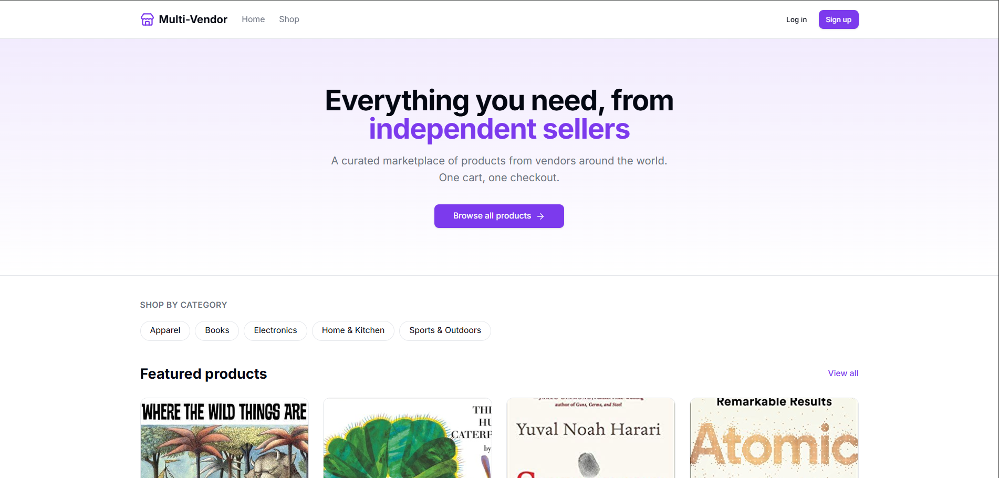
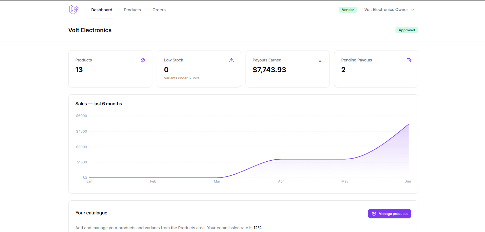
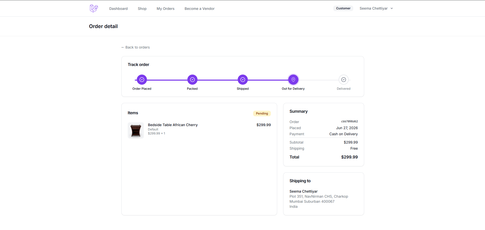
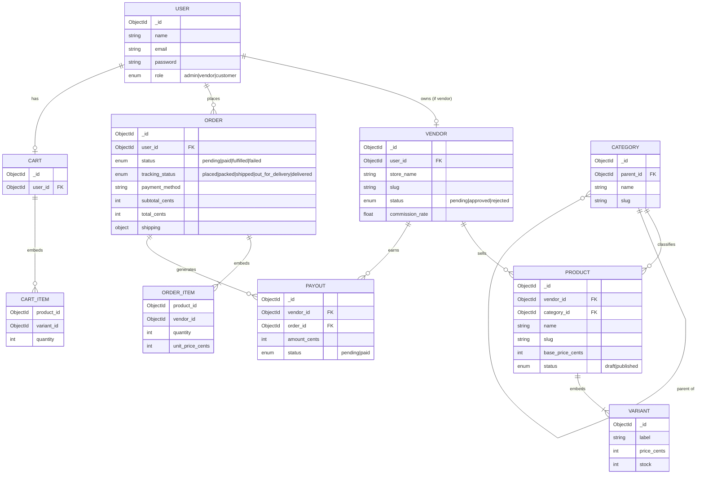

# Multi-Vendor E-Commerce Platform

[](https://github.com/yogeshchettiyar069/multivendor-ecommerce/actions/workflows/ci.yml)
[](LICENSE)


A production-grade, multi-vendor marketplace where independent vendors manage their
own catalogue and orders while a platform admin oversees the whole operation —
built on **Laravel 12**, **MongoDB**, and an **Inertia + React + TypeScript**
front-end, fully containerised so it runs with a single command.

**Live demo:** https://multivendor-ecommerce-hcb6.onrender.com — see [DEPLOY.md](DEPLOY.md)
for free hosting on Render + MongoDB Atlas, click by click.

## Demo accounts

All demo accounts use the password **`password`**.

| Role     | Email                  | Can do                                              |
| -------- | ---------------------- | -------------------------------------------------- |
| Admin    | `admin@example.com`    | Approve vendors, manage categories, view all orders |
| Vendor   | `vendor1@example.com`  | Manage own products, fulfil orders, see sales chart |
| Customer | `customer@example.com` | Browse, cart, checkout, track orders                |

`vendor1@example.com` … `vendor5@example.com` are approved stores;
`vendor6@example.com` is a vendor **awaiting admin approval** (try the approval flow
from the admin account).

## Features

- **Three roles, one app** — customer storefront, vendor dashboard, and admin
  console, gated by role-based middleware.
- **Vendor onboarding** — customers request to become a vendor; an admin approves or
  rejects from the admin console.
- **Real catalogue** — genuine product names, photos, and descriptions across
  fashion, electronics, home, books, and outdoors; faceted search with category
  tree, price-range slider, in-stock filter, and sorting.
- **Variants & inventory** — per-variant stock embedded in each product, decremented
  **atomically inside a MongoDB transaction** so two buyers can never oversell the
  last unit.
- **Cart & checkout** — saved-address reuse, "Buy Now" direct checkout, and multiple
  payment methods (**Card** via Stripe, **UPI**, **Netbanking**, **Cash on Delivery**).
- **Stripe payments** — PaymentIntents + Elements on the front-end, idempotent
  order finalisation driven by a verified Stripe **webhook**.
- **Commission & payouts** — each sale is split by the vendor's commission rate; a
  payout record is created and marked paid on fulfilment.
- **Order tracking** — vendors advance orders through Placed → Packed → Shipped →
  Out for Delivery → Delivered on an animated, mobile-responsive timeline.
- **Vendor analytics** — a sales-over-time area chart (recharts) on the dashboard.
- **Polished UX** — Tailwind + shadcn/ui, dark mode, skeleton loaders, fully
  responsive down to mobile.

## Tech stack

| Layer        | Choice                                                            |
| ------------ | ---------------------------------------------------------------- |
| Backend      | Laravel 12 (PHP 8.3), MVC                                         |
| Database     | MongoDB 7 via `mongodb/laravel-mongodb` (Eloquent-compatible)     |
| Front-end    | Inertia.js + React 18 + TypeScript                               |
| UI           | Tailwind CSS + shadcn/ui + lucide-react + recharts               |
| Auth         | Laravel Breeze (Inertia/React) + role-based access control        |
| Payments     | Stripe (test mode) — PaymentIntents + webhooks                    |
| Infra        | Docker (PHP-FPM, nginx, MongoDB replica set, Redis, queue worker) |
| Quality      | Pest, PHPStan (level 6), Laravel Pint, ESLint + Prettier         |
| CI           | GitHub Actions — lint, static analysis, tests, build             |

## Screenshots

### Storefront



The customer-facing storefront. A hero with a clear value proposition, a
**shop-by-category** bar (Apparel, Books, Electronics, Home & Kitchen, Sports &
Outdoors), and a **Featured products** rail populated from the real catalogue —
genuine product titles and cover art, not placeholder filler.

### Vendor dashboard



The dashboard for an approved vendor store (_Volt Electronics_). KPI cards surface
**product count, low-stock alerts, total payouts earned, and pending payouts**, a
six-month **sales area chart** (recharts) visualises revenue over time, and the
store's commission rate is shown inline. Each vendor sees only their own data.

### Order tracking



A customer's order detail with the **animated tracking timeline** — Order Placed →
Packed → Shipped → Out for Delivery → Delivered — advanced by the vendor. Alongside
it: line items with thumbnails, payment method (here **Cash on Delivery**), order
totals, and the saved shipping address.

## Run it in one command

> **Prerequisites:** [Docker Desktop](https://www.docker.com/products/docker-desktop)
> running. Nothing else — PHP, Node, and MongoDB all live inside the containers.

```bash
cp .env.docker .env          # pre-wired for the Docker stack
docker compose up --build     # build images and boot the whole stack
```

Then open **http://localhost:8080**.

The stack starts six services: `web` (nginx), `app` (PHP-FPM), `mongo`
(single-node **replica set**, required for transactions), `mongo-init` (one-shot
replica-set initiation), `redis`, and a `queue` worker. On first boot the `app`
container waits for a writable MongoDB primary, runs migrations (which create the
indexes), and — when `SEED_ON_BOOT=true` — seeds demo data.

### Useful shortcuts (optional `make`)

```bash
make up       # build + start (detached)
make logs     # tail app/web logs
make shell    # shell into the app container
make test     # run the test suite
make fresh    # wipe volumes and rebuild from scratch
make down     # stop everything
```

## Quality gates

The same checks that run in CI ([.github/workflows/ci.yml](.github/workflows/ci.yml)):

```bash
# Front-end (host)
npm run lint                                   # ESLint
npm run build                                  # tsc type-check + Vite build

# Back-end (inside the app container)
docker compose exec app ./vendor/bin/pint --test                          # code style
docker compose exec app php -d memory_limit=1G ./vendor/bin/phpstan analyse  # static analysis (level 6)
make test                                                                   # Pest suite
```

## Architecture (ERD)

MongoDB is document-oriented, so related data that is always read together is
**embedded** rather than joined: product variants live inside the product, line
items live inside the cart and the order. Cross-aggregate links (a product's vendor,
an order's customer) are stored as references.



## Run without Docker

Requires PHP 8.3 with the `mongodb` extension, Composer, Node, and a MongoDB
replica set (local `mongod --replSet rs0` or a free Atlas M0 cluster).

```bash
cp .env.example .env
composer install
npm install
php artisan key:generate
# point MONGODB_URI at your database, then:
php artisan migrate
npm run dev          # in one terminal
php artisan serve    # in another  ->  http://localhost:8000
```

## MongoDB & transactions

Atomic checkout relies on multi-document MongoDB transactions, which require a
**replica set**. The bundled Docker `mongo` service runs as a single-node replica
set (`--replSet rs0`) and is auto-initiated by the `mongo-init` service. MongoDB
Atlas clusters are replica sets out of the box, so the same code works against a
free Atlas M0 tier by changing only `MONGODB_URI`.

## Deployment

Free, end-to-end hosting on **Render** (single Docker web service) +
**MongoDB Atlas** (free M0 cluster) is documented step by step in
**[DEPLOY.md](DEPLOY.md)**. The production image is
[`Dockerfile.render`](Dockerfile.render) — nginx + PHP-FPM under supervisor in one
container, serving on the platform-provided `$PORT`.

## License

[MIT](LICENSE)
